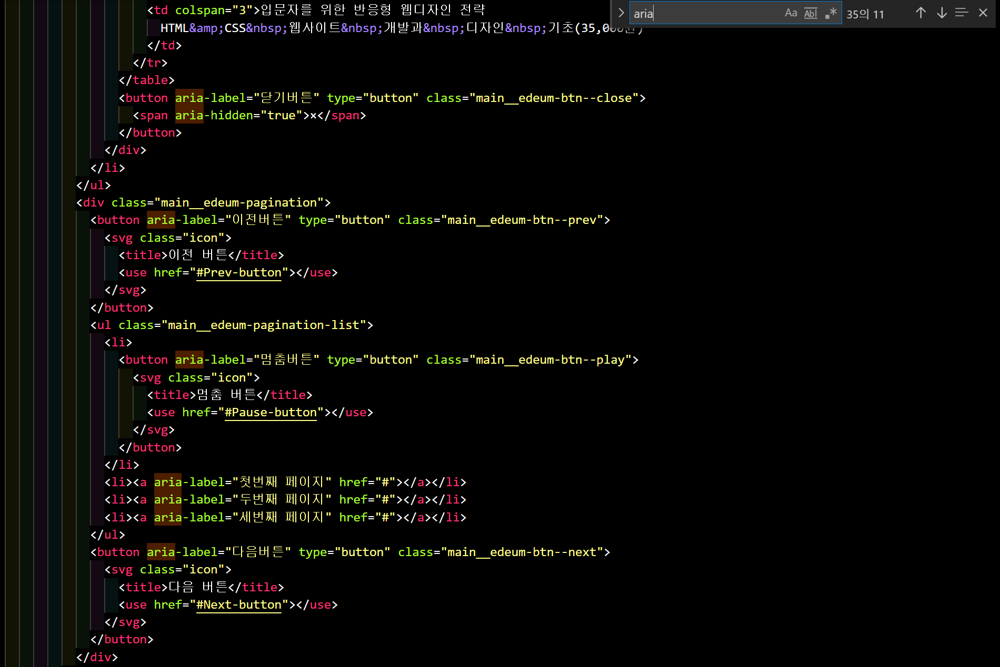
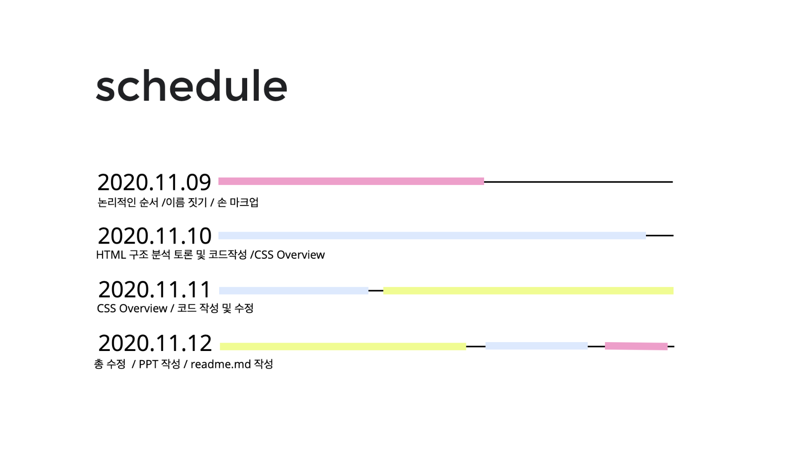

# CAFE W  
---

---

팀이름 : 구진혁
HTML, CSS만으로 웹페이지 UI제작 프로젝트입니다.  
제작기간 2020.11.09 - 2020.11.12  

## 목적  
1달간 배운 HTML, CSS를 바탕으로 실력을 점검하고 복습하려는 취지에서 만들어 보았습니다.  

## 기술 스택  
### Front-End  
- HTML  
- CSS  
### 사용한 에디터
- Visual Studio Code
- Source tree
### 협업 툴  
- git  
- git-hub

## UI 개발  
Developer--제작된 UI 디자인을 토대로 데스크탑 UI를 개발합니다.  
- Visual Studio Code 도구 사용  
- 웹 접근성 (A11Y)  
- 의미있는 구조 설계 (HTML5+ WAI-ARIA)  
- 소스 버전 관리 (Git)  
- 팀 버전 관리 (GitHub)

Semantic Markup(HTML5 + WAI-ARIA) 

Version Control System (Git + GitHub)

 
## Gantt chart  

## 파트 분배  
- 김연구  
  - recommend section
  - lectures section  
  - review-favorite section  
  - repository management(git)

- 최수혁
  - youtube section  
  - reserve section  
  - various section  
  - sign-in seciton

- 전세진
  - main LAB section  
  - curriculum section
  - findshop section  
  - sign-up section

## 팀원소개  
- 김연구 <a href="https://github.com/yg-0103">@yg-0103</a>  

- 전세진 <a href="https://github.com/sejinnni?tab=repositories">@sejinnni</a>  

- 최수혁 <a href="https://github.com/choisuhyeok1255">@choisuhyeok1255</a>
